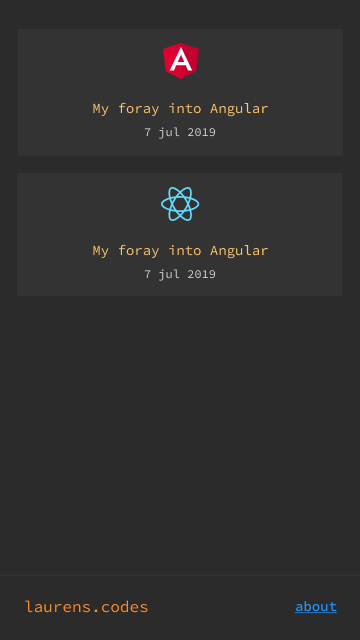

# Building the blog

## How
Of course you can do it easily via wordpress or pre-built themes and stuff like that. 
In my opinion, if you're a **frontend** developer, you have to make it yourself from scratch. And no, you can't use gatsby or any other frontend framework for this. Pick the right tools for the job. This is a blog. I mean, come on 😅.

Sooo, I wanted my blog to as simple as possible, for me to write and deploy.
I like to keep things simple, and I was wondering whether it would make sense to write my blogs in markdown instead of html. I chose markdown, however, looking back, I'm not entirely convinced.

Pros:

  * I, as a frontend developer, will not have to concern myself with cumbersome html tags 😀.
  * Euh... Ah right, I can just write stuff down on any device. Well, not really.

Cons:

  * Have to write scripts to convert the .md files to .html.
  * Conversion can do things that I did not intend to. I do not know the inner workings of the program that does it.
  * I had to learn a syntax I was not 100% familiar with. I opened the [cheat sheet](https://github.com/adam-p/markdown-here/wiki/Markdown-Cheatsheet) constantly. How much traffic would this repo get? 🤔😃

Looks like I made the wrong choice.
Oh well, there's time atm and scripting is fun.

## Design

I love this stuff, but I'm a noob.

LOL 😁 

Asked for some pointers on discord for this last design. They rightfully pointed out that I should not use a dark theme for large chunks of text. Also I did not like the colors. Quick fix.

## Requirements

**Must haves:**

  * Able to jot down stuff in markdown in a `draft` folder. 
  * Once it's ready, move the markdown file and any image references it has to a `ready` folder. Also extract the date when the file was created, and place it beneath the h1 or #.
  * Convert everything from the ready folder from .md to .html
  * Extract the h1, image, date and filename from the blogpost html files, so it can be injected in the index.html file. If I'm doing this, my index.html can't be to too big. So I'll just make sure every post image is an svg that's inlined (so you don't need multiple network requests to fetch all the images).
  * Also wrap the loose html files into a properly arranged html document, with title, article tags, etc...

**Nice to haves**

  * Optimize all images. I know, this should not be a nice to have. **FIXED**
  * Making it so that it feels like an SPA. When clicking on a blogpost from the homepage, delete all articles with simple js, fetch the required blogpost.html, parse the content so you only have the content, not the other unwanted html tags and inject it. Fetching will be asynchronous so there will be a delay. You could prefetch the top 5 posts or something. Orrrr I could probably just keep all the blog posts, as text in one big js file (probably won't even be that big) and lazy load that (if not on mobile). Great, let's do that, much simpler.

Oh boy, this markdown stuff is great. Alright, let's do this.

## Code

I did some stuff already in bash, but I've committed to a hard deadline, so I'm just doing it all in node atm. I know, not the right tool for the job. To quote a friend of mine:
> A good developer is also developer who gets things done.

Done blogging now, check out the code on github.

