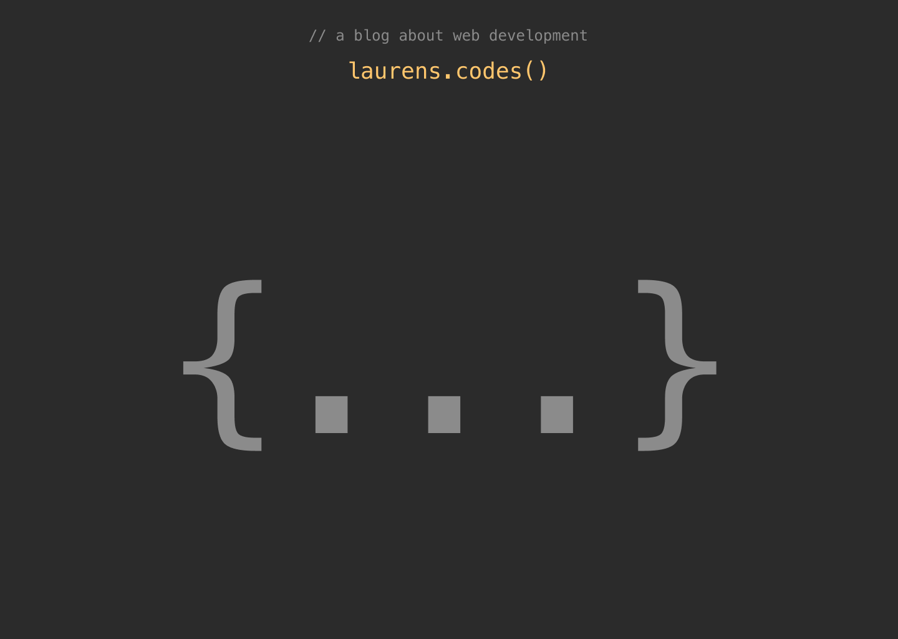
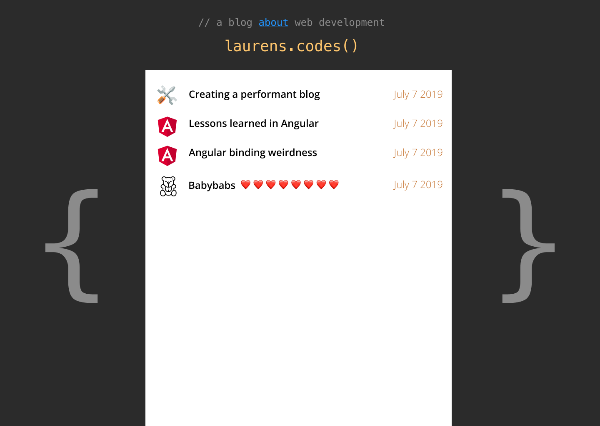
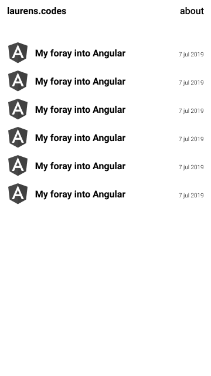
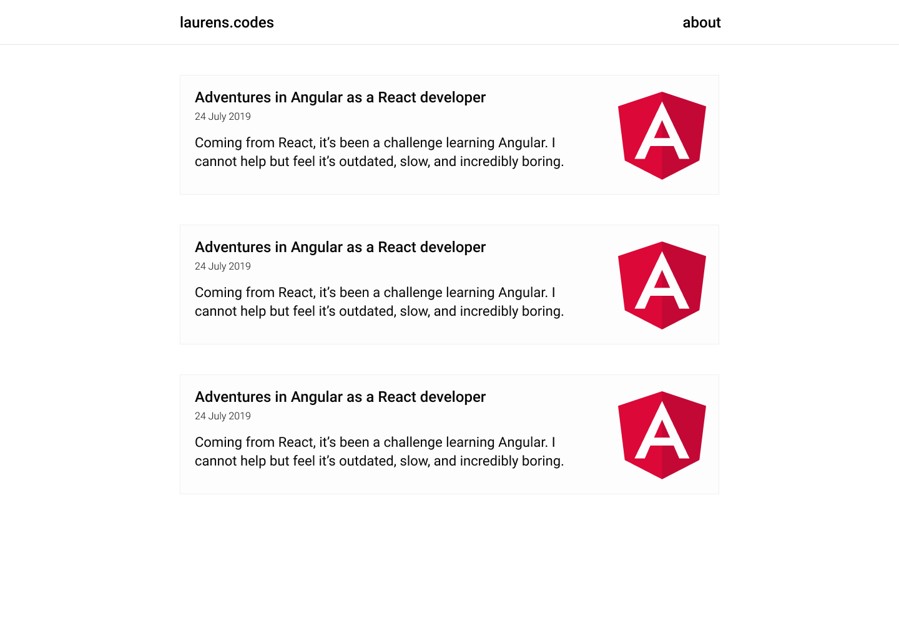
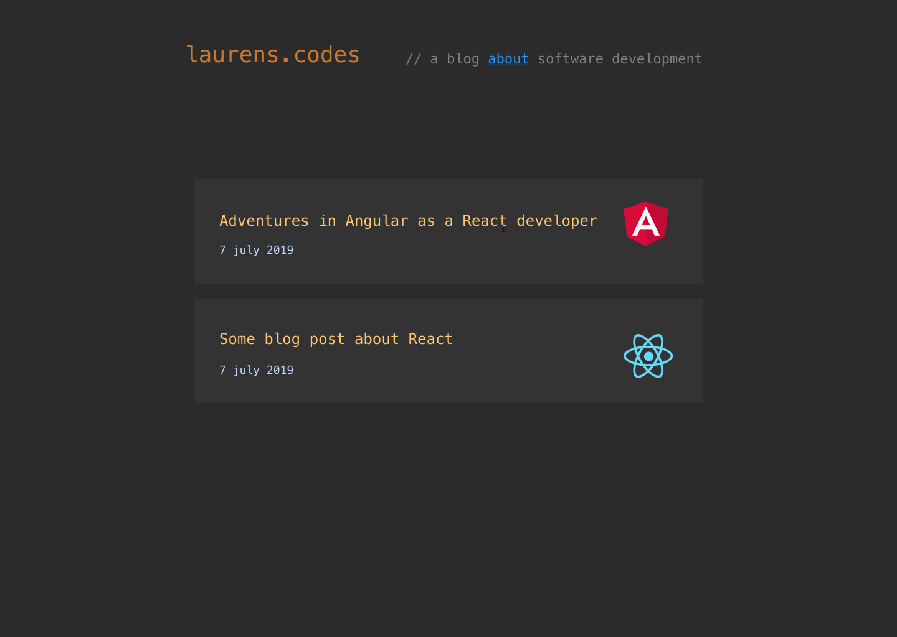
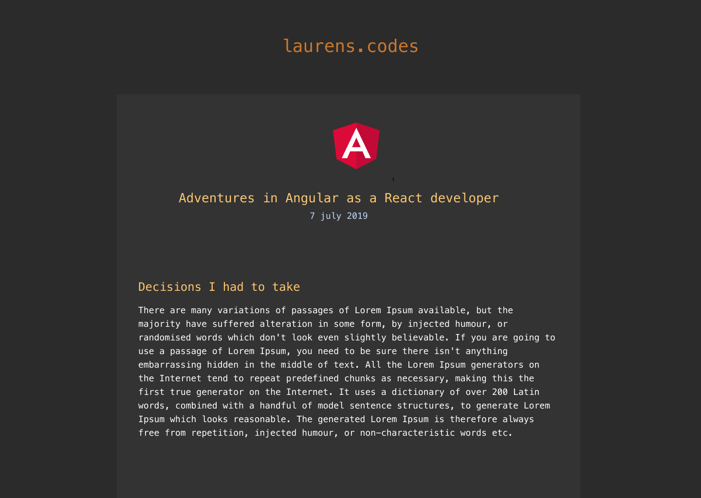

# The creation of my blog website, aka my own static site generator

## What

I wanted a blog website where I could talk about my code learnings.
It needed to be as simple as possible, but also perform reasonably well.
My requirements:

- I should only worry about writing content.
- Images need to be responsive.
- Svg's need to be inlined.
- Make it an SPA. This is a nice to have, and probably not for first release.

## How

### Tooling

There's tons of tools available to make blog websites.
However, if you're a developer, especially a frontend developer, I'm of the opinion that you have to build it yourself. That leaves out WordPress and the likes.

Then there's great stuff available for building blogs with modern js frameworks, such as [Gatsby](https://www.gatsbyjs.org/).
It's quick and easy (if you're proficient in React).
But, it comes with a bunch of client side Javascript that is totally unnecessary.

Then there's Hugo, Jekyll, and the one that fits my needs the most, [eleventy](https://www.11ty.io/docs/).

The thing is, being a frontend developer, I feel like I'm constantly having to learn new APIs instead of actually coding. I'm tired of digging into documentation, stackoverflow, and github issues to make the thing do what I want it to do.

For simple enough stuff like a blog, I'd much rather do it all myself.

## Design

Let's not forgot about design. I'm a noob but love doing it.

LOL 😁

I envisioned these brackets to slide open and go to the sides when first visiting the page.
Ugly AF though.

Almost went with this next one but felt it wasn't simple enough.

My god this is boring.

Ah this feels semi alright.

I felt the colors were off a bit, and something else didn't feel quite right. So I went over to a discord UI channel to ask for some feedback. They rightfully pointed out that I should not use a dark theme for large chunks of text. So I changed it to the current design you're now viewing 🙂.

## Code

Initially, I started out in bash because I wanted to learn a new language. It quickly turned out to be way to time consuming. Perl and Python are much better candidates for the job. I decided to skip my own advice of picking the right tool for the job, and going with what I know already, Javascript.

To quote my friend:
> A good developer is a developer who gets things done.

### Implementing the requirements

#### I should only worry about writing content

Everyone and everything is using Markdown to write their content at the moment, so I went with it. This means writing my content in `.md` files and then converting them to HTML.

However, looking back on my decision, I'm not quite convinced.

Pros of writing in markdown:

- I, as a frontend developer, do not have to concern myself with cumbersome HTML tags 😄.
- Euh...

Cons:

- I have to write scripts to convert the .md files to .html. Conversion can do unwanted things. I do not know how the package ([showdown](https://github.com/showdownjs/showdown)) works.
- I had to learn a syntax I wasn't 100% familiar with. I referenced this [cheat sheet](https://github.com/adam-p/markdown-here/wiki/Markdown-Cheatsheet) constantly. How much traffic would this repo get? 🤔😃

#### Images need to be responsive

This means creating 4 versions of each image. Mobile, mobile webP, desktop, desktop webP.

#### Svg's need to be inlined

This means you have no extra network request fetching the image. It's bad if you use the same svg over and over again.

#### Make it an SPA

This means, when you're on the index page, and you click on a blogpost, you don't want to load another external recourse (blogpost.html) and refreshing the page. Or the other way around (blogpost -> index).

Once you click on a particular blogpost on the index page, remove all HTML.

It's super easy to do. Store the all the blogposts and their contents in a `.JSON` file. Lazily load that file. Parse it with Javascript.